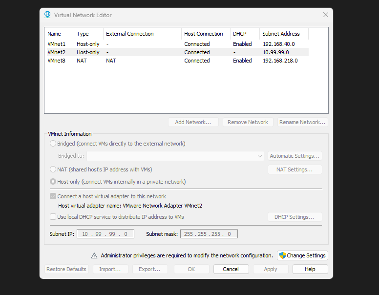
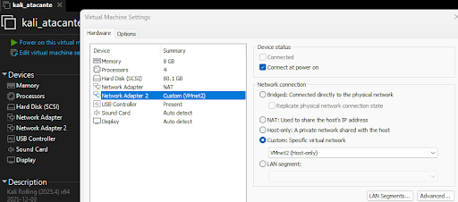
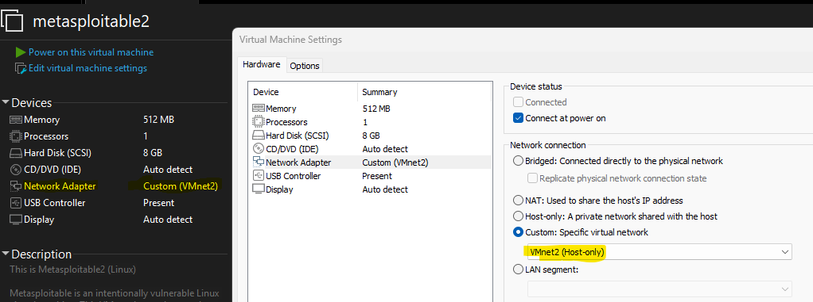
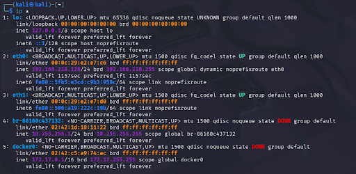
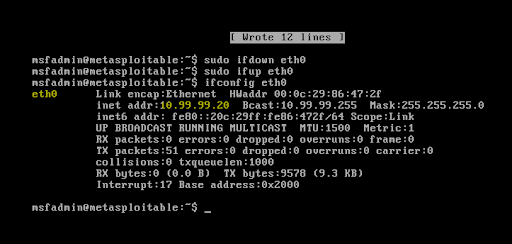
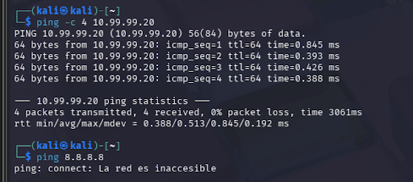

\## Evidencias de configuración

\### Red aislada VMnet2

VMnet2 se configuró como una red Host-only para mantener el laboratorio aislado del equipo anfitrión, la red local e Internet.

\### Adaptador de Kali Linux

La máquina auditora Kali Linux se conectó a la red virtual VMnet2.

\### Adaptador de Metasploitable 2

La máquina objetivo Metasploitable 2 se conectó exclusivamente a la misma red virtual VMnet2.

\### Direccionamiento IP estático

Kali Linux utiliza la dirección `10.99.99.10/24` y Metasploitable 2 utiliza `10.99.99.20/24`.

\### Validación de conectividad

La conectividad desde Kali Linux hacia la máquina objetivo fue validada mediante ICMP.

